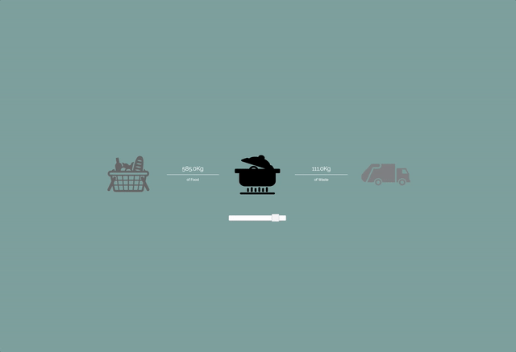

## Calculator

Engineering Comes Home Calculator using [purescript-flare](https://github.com/sharkdp/purescript-flare).



## Quick start

You will need Purescript 0.10.x and pulp. See the [Purescript website](http://www.purescript.org/download/) for installation instructions. Then, run:

```
git clone git@git.iilab.org:engineeringcomeshome/calculator.git
cd calculator
bower install
pulp -w build -O -t main.js
```

Then serve the folder with an http server, for instance with `http-server`:
```
hs .
```

Then go to http://127.0.0.1:8080

## Gnuplot

`pulp psci`

```
> import Repl
> plotData $ mapFoldStates $ scanNexus systemStateEx
```

# Offline Deployment Setup

Requirements
 - Android as a local hotspot
   - Swiftp to transfer files
   - SimpleHTTPServer to serve files.
 - OSX
   - lftp to recurse transfer

```
scripts/dist.sh
```

## Credits

Icons on the LCA Calculator from thenounproject.com : “Food Shopping”, “Managed Waste” symbol by Edward Boatman, “Cooking” symbol by Creative Stall, “Waste Bin”, "Food Sharing" by OCHA Visual Information Unit, “Composting” by Gemma Garner, “Food Garden” by To Uyen, “Tap Water” by Symbolon, "Rain" by AlePio.

## License

Mozilla Public License Version 2.0
